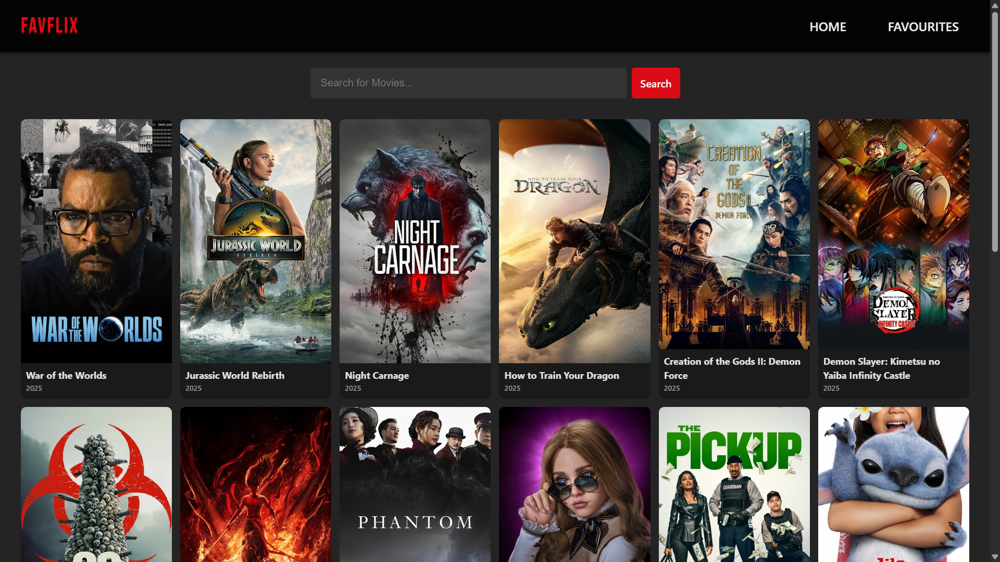

# 🎬 Movie Explorer

Movie Explorer is a React-based web application that allows users to search for movies, browse popular titles, and manage a list of their favourite movies.  
It uses [The Movie Database (TMDB) API](https://www.themoviedb.org/) for movie data.

---

## 🚀 Features
- 🔍 **Search** movies by title
- 📈 **Browse** popular movies
- ❤️ **Add / remove favourites** with persistent storage
- 📅 Display movie release year
- 📜 Load more movies with smooth scrolling
- 🎨 Responsive, clean UI

---

## 🛠 Tech Stack
- **Frontend:** React, CSS
- **State Management:** React Context API
- **API:** TMDB API
- **Build Tool:** Vite

---

## 📦 Installation

1. **Clone the repository**
   ```bash
   git clone https://github.com/MayankMohit/Movie-App.git
   cd Movie-App/frontend
   ```

2. **Install dependencies**
   ```bash
   npm install
   ```

3. **Set up environment variables**
   - Create a `.env` file in the root of the `frontend` folder:
     ```env
     VITE_API_KEY=your_tmdb_api_key
     ```
   - Replace `your_tmdb_api_key` with your API key from [TMDB API Docs](https://developer.themoviedb.org/).

4. **Run the development server**
   ```bash
   npm run dev
   ```

5. **Build for production**
   ```bash
   npm run build
   ```

---

## 🔗 API Reference

### Get Popular Movies
```
GET https://api.themoviedb.org/3/movie/popular
```

### Search Movies
```
GET https://api.themoviedb.org/3/search/movie
```

Include your API key as a query parameter:  
`?api_key=YOUR_TMDB_API_KEY`

---

## 📂 Folder Structure
```
frontend/
├── public/
├── src/
│   ├── assets/
│   ├── components/
│   ├── contexts/
│   ├── css/
│   ├── pages/
│   ├── services/
│   ├── App.jsx
│   ├── main.jsx
├── .gitignore
├── README.md
├── eslint.config.js
├── index.html
├── package-lock.json
└── package.json
```

---

## 🤝 Contributing
Contributions are welcome! Please:
1. Fork the repo
2. Create a new branch (`feature/your-feature`)
3. Commit your changes
4. Push to your fork and open a PR

---

## 📜 License
This project is licensed under the MIT License. See the [LICENSE](LICENSE) file for details.

---

## 📷 Screenshots
### Home Page


### Favourites Page


---

## 📧 Contact
For questions or suggestions, contact:
- **Mayank Mohit** – [GitHub Profile](https://github.com/MayankMohit)
